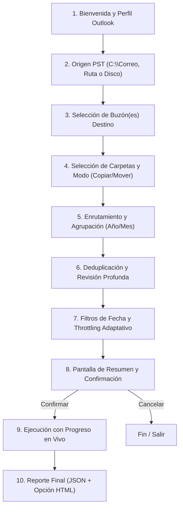

# AGENTS.md — Outlook Organizer TS

Documento de contexto técnico, directrices de arquitectura y reglas operativas para agentes de IA y desarrolladores que trabajen en este repositorio.

---

## 1. Propósito y Descripción General

**Outlook Organizer TS** es una herramienta de terminal (TUI) desarrollada en **Rust** (edición 2024) para la gestión, escaneo, organización e importación avanzada de archivos PST (`.pst`) hacia buzones de correo de Microsoft Outlook / Exchange / Microsoft 365 (buzones principales o compartidos).

### Componentes Clave de la Arquitectura:
- **Frontend / Interfaz**: Terminal User Interface (TUI) rica y moderna implementada con [`ratatui`](https://crates.io/crates/ratatui) y [`crossterm`](https://crates.io/crates/crossterm).
- **Backend / Automatización**: Motor de integración con Outlook basado en **PowerShell** automatizando **Outlook COM / MAPI** (`Outlook.Application`, `Namespace.MAPI`, etc.).
- **Comunicación Rust <-> PowerShell**: Ejecución estructurada mediante pipes/stdin/stdout o invocaciones con telemetría en tiempo real hacia la TUI para reportar progreso, throttling y logs.

---

## 2. Capacidades y Características Principales

### 2.1. Escaneo y Descubrimiento de Archivos PST
- **Ruta por defecto**: `C:\Correo`.
- **Modos de búsqueda**:
  - Escaneo de ruta específica personalizada.
  - Escaneo completo de disco/unidad.
- Selección individual o masiva de archivos `.pst` encontrados.

### 2.2. Destino y Perfiles de Outlook
- **Buzones destino**: Soporte para importar hacia un buzón único o múltiples buzones compartidos (*Shared Mailboxes*).
- **Perfil de Outlook**:
  - Uso del perfil predeterminado del sistema.
  - Especificación de un perfil MAPI concreto por nombre.

### 2.3. Enrutamiento y Agrupación Temporal
- **Enrutamiento configurable**: Activación/desactivación de enrutamiento inteligente.
- **Estructura de carpetas por fecha**:
  - Agrupación por **Años** (ej. `Bandeja de entrada / 2024`).
  - Agrupación por **Meses** (ej. `Bandeja de entrada / 2024 / 05-Mayo`).
  - Rango: opción de procesar "Todos los años/meses" o seleccionar un año/mes específico.

### 2.4. Selección de Carpetas y Modo de Transferencia
- **Selección de carpetas de origen**: Bandeja de entrada, Elementos enviados, Elementos eliminados, Borradores, carpetas personalizadas, etc.
- **Acción sobre el correo**:
  - **Copiar**: Los correos originales permanecen intactos en el archivo PST.
  - **Mover**: Los correos se transfieren al buzón y se eliminan del PST original.

### 2.5. Detección y Omisión de Duplicados
- **Detección inteligente**: Comparación basada en `Message-ID`, `SearchKey` (MAPI) o clave compuesta (Asunto + Remitente + Fecha/Hora de recepción).
- **Modos de escaneo de duplicados**:
  - **Estándar**: Consulta directa en la carpeta de destino correspondiente.
  - **Revisión profunda**: Indexa recursivamente subcarpetas del destino (más exhaustivo, detecta correos que los usuarios hayan movido manualmente a subcarpetas).

### 2.6. Filtros y Rendimiento
- **Filtros de fecha**: Filtro por año y mes específico, o sin filtro (importar historial completo).
- **Throttling adaptativo (Anti-Throttling)**: Detección de latencias y límites de peticiones (429 / MAPI backoff) en Exchange Online / Microsoft 365, con desaceleración dinámica y reintentos exponenciales para prevenir bloqueos del buzón.

### 2.7. Seguridad, Integridad del PST y Manejo de Interrupciones (Crítico)
- **Naturaleza frágil de los PSTs**: Los archivos `.pst` son propensos a corrupción si se produce un cierre forzado, terminación abrupta o liberación inadecuada de punteros COM/MAPI mientras Outlook mantiene abierto el archivo.
- **Protocolo de Parada Segura (Graceful Shutdown / Cancelación Limpia)**:
  - Si el usuario presiona `Ctrl+C`, `Esc` o el botón de cancelar, la aplicación **bajo ninguna circunstancia debe terminar el subproceso a la fuerza (kill abrupto)**.
  - Debe transicionar inmediatamente a un estado visual de **"Cancelando con seguridad..."**: completar la transferencia del correo en curso, detener el bucle de lectura, desmontar el PST de la sesión MAPI (`Namespace.RemoveStore`), forzar la recolección de basura/liberación COM y recién entonces liberar los recursos.
- **Acceso en Modo Solo Lectura (cuando aplica)**:
  - En modo **Copiar** (predeterminado), abrir el PST preferentemente con flags de sólo lectura o evitar cualquier mutación de metadata/cabeceras para preservar su hash e integridad intactos.
- **Transaccionalidad en modo Mover**:
  - Un correo del PST solo debe eliminarse tras recibir la confirmación inequívoca de que fue persistido con éxito en el buzón destino.
  - Si ocurre una interrupción o error durante el modo Mover, la parada se efectúa inmediatamente antes de iniciar el siguiente ítem, impidiendo que cualquier mensaje quede a medio procesar o duplicado/perdido.
- **Desmontaje y Liberación Garantizados (`Finally` blocks)**:
  - El script de PowerShell debe encapsular el ciclo de vida del PST en bloques `try {} finally {}` para asegurar que `RemoveStore` y la liberación de COM ocurran siempre, incluso ante excepciones no controladas o fallos imprevistos.
- **Detección de Bloqueos Previos**:
  - Antes de abrir un PST, verificar si otro proceso (ej. Outlook en segundo plano o una instancia colgada) lo mantiene bloqueado con candado de archivo en el sistema de archivos, alertando al usuario antes de fallar a mitad del proceso.

---

## 3. Flujo de Trabajo en la TUI

1. **Configuración del perfil**: Perfil actual o indicar nombre.
2. **Selección de fuentes PST**: Lista interactiva con checkboxes.
3. **Selección de destino**: Selección de buzón(es).
4. **Configuración de transferencia**: Carpetas a incluir, opción Copiar vs. Mover.
5. **Enrutamiento y agrupación**: Por año / mes / todos / específico.
6. **Políticas de duplicados**: Criterios de duplicación y revisión profunda (on/off).
7. **Filtros y velocidad**: Rango de fechas y Throttling adaptativo.
8. **Resumen de confirmación**: Pantalla previa detallada antes de alterar datos.
9. **Monitoreo en tiempo real**: Barras de progreso, correo actual procesado, velocidad de transferencia, reintentos y logs.
10. **Cierre de operación y auditoría**: Generación de reportes.

---

## 4. Auditoría, Logs y Reportes

### 4.1. Registro JSON Automático
- **Condición de generación**: **Solo en compilación de producción (`.exe`)**. En modo desarrollo (`cargo run` o `debug`), no se crea automáticamente a menos que se fuerce por flag.
- **Ruta del archivo**: Se almacena en una subcarpeta fechada generada por la aplicación (ej. `.\logs\YYYY-MM-DD\run_HH-MM-SS.json` o directorio de ejecución).
- **Contenido**:
  - Timestamp de inicio y fin.
  - Estado: `Completado`, `Interrumpido por el usuario` o `Fallido con error`.
  - Configuración aplicada.
  - Métricas: Correos analizados, copiados/movidos, duplicados omitidos, errores de lectura.
  - Lista de PSTs procesados y buzones impactados.

### 4.2. Informe Visual HTML
- Al finalizar la ejecución, se ofrece la opción interactiva de generar un **Informe HTML**.
- **Diseño**: Interfaz web moderna, visual, responsive, con métricas destacadas, tablas de resultados y diseño limpio.
- **Ubicación**:
  - Por defecto: en la misma carpeta fechada del ejecutable.
  - Personalizada: el usuario puede ingresar una ruta de guardado alternativa.

---

## 5. Directrices Técnicas y Reglas para Desarrolladores / Agentes

1. **Elevación y Permisos de COM**:
   - Recordar que la automatización de Outlook mediante COM requiere consistencia de privilegios: si Outlook se ejecuta sin elevación, el script de PowerShell / ejecutable Rust no debe ejecutarse en un contexto con permisos dispares que bloquee el binding COM.
2. **Manejo Seguro de Errores en PowerShell**:
   - Siempre liberar objetos COM mediante `[System.Runtime.InteropServices.Marshal]::ReleaseComObject($obj)` y recolección de basura para no bloquear los archivos `.pst` en disco.
3. **Diseño de la TUI**:
   - Utilizar componentes limpios de `ratatui` (Tabs, ListState, Paragraph, Gauge, Block, Table).
   - Mantener arquitectura modular: separar el bucle de eventos (`crossterm`), la máquina de estados de la UI (`App` state) y el canal de mensajería asíncrona con el worker de PowerShell.
4. **No Destructivo por Defecto**:
   - La opción predeterminada de transferencia debe ser siempre **Copiar** para evitar pérdida accidental de datos en los PSTs.
5. **Mitigación Crítica de Corrupción de PST ante Señales de SO**:
   - Atrapar `Ctrl+C` / `SIGINT` en Rust mediante `tokio::signal` o `crossterm::event` para enviar un comando de detención suave (`Abort`/`Cancel`) al worker PowerShell en lugar de abortar el proceso inmediatamente (`std::process::exit`).
   - El worker debe confirmar la desconexión limpia del almacén MAPI (`RemoveStore`) antes de devolver el control y cerrar la aplicación.
6. **Optimización Extrema y Eficiencia de Recursos (Bajo Overhead)**:
   - **Renderizado Reactivo (Event-Driven)**: La TUI no debe ejecutar un bucle ocupado (*busy loop*). Solo redibujar cuando ocurra un evento de teclado, redimensión o tick de telemetría/progreso. El consumo de CPU en reposo debe ser cercano al **0%**.
   - **Throttling de Telemetría (Coalescing)**: En el worker de PowerShell, acumular métricas y emitir telemetría cada 100 ms o por lotes de ítems, impidiendo que el pipe de `stdout` sature el planificador asíncrono de Rust.
   - **Gestión Estricta de Memoria en COM / PowerShell**: Procesar correos ítem por ítem o en lotes reducidos, liberando cada referencia COM inmediatamente (`ReleaseComObject`) y forzando `[GC]::Collect()` periódico para evitar que la memoria crezca indefinidamente durante la importación de PSTs de varias decenas de gigabytes.
   - **Buffers Circulares para Logs**: En la TUI, limitar el buffer de logs en memoria a un tamaño fijo (ej. últimas 200–500 líneas en un `VecDeque`), evitando fugas de memoria (*memory leaks*) en migraciones prolongadas de cientos de miles de correos.
   - **Flags de Optimización en Release**: Configurar el perfil `[profile.release]` en `Cargo.toml` con `lto = "fat"`, `codegen-units = 1`, `opt-level = 3` y `strip = true` para un binario ultra compacto y de alto rendimiento.

---

## 6. Flujo de Trabajo Git: GitHub Flow

El proyecto sigue estrictamente el modelo **GitHub Flow**:

1. **Rama principal protegida (`main`)**:
   - La rama `main` siempre debe ser desplegable y encontrarse en estado verde (compila sin errores, pasa lints y pruebas).
2. **Ramas descriptivas basadas en features/correcciones**:
   - Crear una rama directamente a partir de `main` con nombres semánticos:
     - `feature/nombre-de-la-funcionalidad`
     - `fix/descripcion-del-bug`
     - `docs/actualizacion-documentacion`
     - `refactor/area-a-mejorar`
3. **Commits atómicos y descriptivos**:
   - Mensajes de commit claros en modo imperativo o convencional (ej. `feat: implementar footer con marca de agua Timeless Support`, `fix: asegurar RemoveStore en bloques finally`).
4. **Pull Requests (PRs)**:
   - Abrir un PR temprano para discutir cambios.
   - Todo PR debe compilar (`cargo check`, `cargo test`) antes de ser fusionado.
5. **Merge y Despliegue**:
   - Una vez revisado y aprobado, se fusiona a `main` mediante merge o rebase/squash según la política del equipo.
