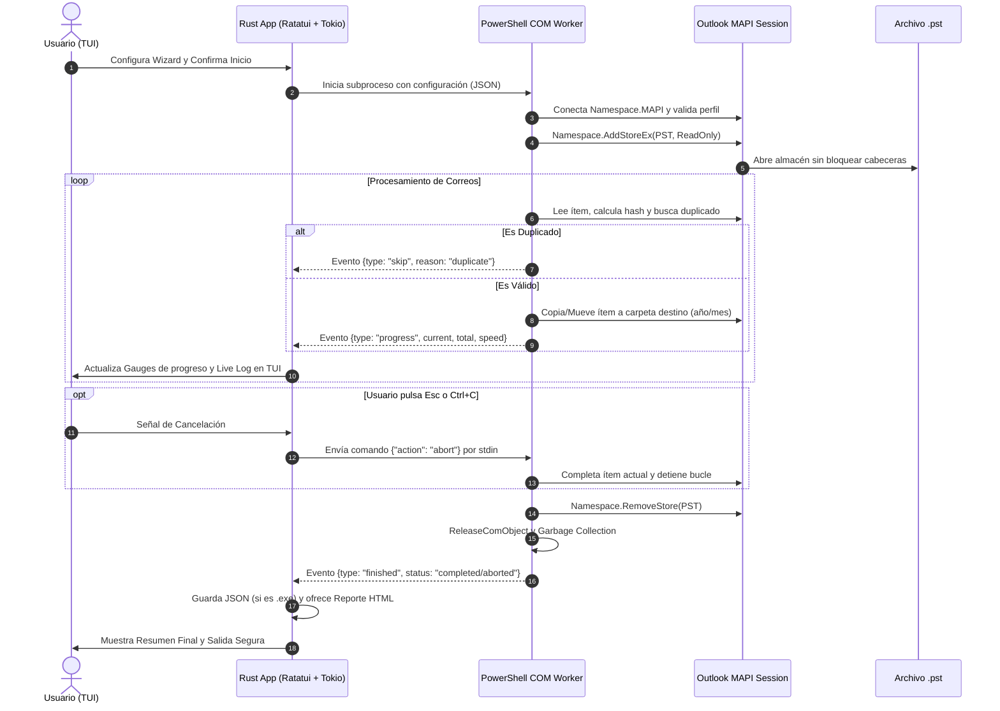

# PRD.md — Documento de Requisitos del Producto (Product Requirements Document)

## Outlook Organizer TS

**Versión**: 1.1.0  
**Fecha de Actualización**: 2026-09-15  
**Estado**: Especificación Técnica Completa / Listo para Implementación  
**Organización**: Timeless Support  
**Stack Clave**: Rust (2024 Edition) + Ratatui + Crossterm + PowerShell (MAPI/COM)  

---

## 1. Visión del Producto y Objetivos Estratégicos

### 1.1. Resumen Ejecutivo
**Outlook Organizer TS** es una aplicación de terminal (TUI) de nivel empresarial diseñada para ingenieros de soporte y administradores de sistemas. Permite la ingesta masiva, auditoría, clasificación temporal, deduplicación y transferencia controlada de correos contenidos en archivos `.pst` hacia buzones de Microsoft Outlook / Exchange Online / Microsoft 365 (buzones personales o compartidos), garantizando la integridad absoluta del archivo de origen mediante mecanismos estrictos de resiliencia y parada segura (*Graceful Shutdown*).

### 1.2. Problemática y Desafíos del Negocio
| Problema Crítico | Impacto Operativo | Solución en Outlook Organizer TS |
| :--- | :--- | :--- |
| **Corrupción de archivos PST** | Pérdida irreparable de historial de correo ante cierres forzados (`kill`, `Ctrl+C`). | Protocolo de parada segura (*Graceful Shutdown*), modo sólo lectura y desmontaje forzado en bloques `finally`. |
| **PSTs dispersos y desorganizados** | Dificultad para localizar archivos en discos y estructuras locales. | Motor de escaneo con ruta rápida `C:\Correo`, ruta personalizada o escaneo total de unidades. |
| **Duplicación masiva en buzones** | Agotamiento prematuro de cuotas de Exchange/M365 y confusión del usuario final. | Deduplicación heurística por `Message-ID`, `SearchKey` o clave compuesta con **Revisión Profunda (Deep Scan)**. |
| **Throttling en Exchange Online (Error 429)** | Conexiones bloqueadas temporalmente por Microsoft al transferir ráfagas de correos. | Algoritmo de **Throttling Adaptativo** con monitoreo de latencia y reintentos exponenciales dinámicos. |
| **Falta de trazabilidad y auditoría** | Incertidumbre sobre qué mensajes fueron movidos, omitidos o fallaron. | Generación de bitácoras estructuradas en JSON (automáticas en release) e informes visuales interactivos en HTML. |

### 1.3. Objetivos Cuantitativos y Métricas de Calidad
- **Tolerancia Cero a la Corrupción (0%)**: Ningún PST debe quedar en estado inconsistente o bloqueado en el sistema de archivos tras una interrupción de usuario.
- **Rendimiento de Interfaz TUI**: Renderizado fluido a ≥ 30 FPS en `ratatui` sin congelamiento de UI durante operaciones pesadas de E/S.
- **Precisión de Deduplicación**: Eficiencia > 99.8% en la detección de correos preexistentes tanto en la carpeta destino como en subcarpetas (con Deep Scan activo).
- **Trazabilidad 100%**: Registro exacto de cada ítem (procesado, omitido por duplicado, error de lectura).

---

## 2. Personas y Casos de Uso

### 2.1. Arquetipos de Usuario
1. **Ingeniero de Soporte TI (Timeless Support)**: Realiza onboarding/offboarding, consolidación de archivos PST heredados hacia *Shared Mailboxes* departamentales.
2. **Administrador de Sistemas / Mensajería**: Requiere migrar archivos históricos respetando estructuras estrictas por año/mes y auditando cada elemento.

### 2.2. Casos de Uso Principales
- **CU-01: Ingesta Masiva Desatendida a Buzón Compartido**: Escaneo de un disco con 15 PSTs, selección múltiple, deduplicación profunda, enrutamiento a `Ventas@empresa.com` y generación de informe HTML.
- **CU-02: Extracción Filtrada por Periodo Temporal**: Importar exclusivamente el correo del año 2023 contenido en un PST local hacia la Bandeja de Entrada del usuario principal sin tocar otros años.
- **CU-03: Cancelación Inmediata Segura**: Usuario inicia una operación de 50,000 correos, presiona `Esc`, y el software detiene la transferencia de forma atómica y desmonta el PST sin daño alguno.

---

## 3. Requisitos Funcionales Detallados (RF)

### Módulo 1: Descubrimiento y Gestión de Origen (PST)
- **RF-01.1 (Ruta Predeterminada)**: Acceso directo con un solo toque a `C:\Correo` como carpeta raíz de archivo estándar.
- **RF-01.2 (Ruta Personalizada)**: Entrada de texto interactiva con validación inmediata de ruta y existencia de archivos `.pst`.
- **RF-01.3 (Escaneo Completo de Unidad)**: Búsqueda recursiva en discos seleccionados (`C:\`, `D:\`, etc.) mostrando indicador de actividad mientras indexa.
- **RF-01.4 (Listado Interactivo y Selección Múltiple)**:
  - Tabla con checkbox `[x]`, nombre del PST, ruta absoluta, peso en MB/GB y fecha de última modificación.
  - Atajos rápidos: `[a]` seleccionar todos, `[n]` deseleccionar todos, `Espacio` alternar individual.
- **RF-01.5 (Validación Previa de Candados)**: Comprobación de que ningún PST esté bloqueado por otra instancia o proceso (`FileShare::None`) antes de iniciar.

### Módulo 2: Perfiles MAPI y Selección de Destino
- **RF-02.1 (Perfil del Sistema)**: Conexión transparente al perfil predeterminado de Microsoft Outlook configurado en Windows.
- **RF-02.2 (Perfil Específico)**: Opción para ingresar el nombre exacto de un perfil MAPI alternativo.
- **RF-02.3 (Buzón Principal)**: Detección y asignación del buzón principal asociado al perfil.
- **RF-02.4 (Buzones Compartidos / Shared Mailboxes)**: Enumeración y selección de buzones adicionales montados en la sesión de Outlook hacia los cuales el usuario posea permisos de escritura.

### Módulo 3: Alcance de Carpetas y Modo de Transferencia
- **RF-03.1 (Selector de Carpetas Origen)**: Checkboxes individuales para:
  - `[x]` Bandeja de entrada (*Inbox*)
  - `[x]` Elementos enviados (*Sent Items*)
  - `[ ]` Elementos eliminados (*Deleted Items*)
  - `[ ]` Borradores (*Drafts*)
  - `[x]` Carpetas personalizadas / subcarpetas existentes en el PST
- **RF-03.2 (Modo Copiar - Predeterminado y Seguro)**:
  - Transfiere los correos manteniendo los originales en el archivo PST sin mutar sus cabeceras.
  - Apertura del PST con atributos de solo lectura a nivel de API/sistema de archivos siempre que sea posible.
- **RF-03.3 (Modo Mover - Destructivo y Transaccional)**:
  - Transfiere el mensaje y lo elimina del PST de origen.
  - **Regla de Transaccionalidad Estricta**: El borrado en el PST solo se ejecuta tras confirmación de guardado persistente en el buzón de destino. En caso de corte o interrupción, el ítem en curso no se borra.
  - Advertencia visual prominente en color ámbar/rojo en la TUI al activar esta opción.

### Módulo 4: Enrutamiento Inteligente y Agrupación Temporal
- **RF-04.1 (Switch de Enrutamiento)**: Permite habilitar o deshabilitar la categorización por fechas.
- **RF-04.2 (Agrupación por Años)**: Crea automáticamente carpetas hijas con el año del mensaje (ej. `Inbox / 2024`).
- **RF-04.3 (Agrupación por Años y Meses)**: Crea estructura jerárquica de dos niveles (ej. `Inbox / 2024 / 05-Mayo`).
- **RF-04.4 (Rango Temporal)**: Opción para procesar "Todos los años/meses" o restringir a un año o mes específico.

### Módulo 5: Deduplicación y Revisión Profunda
- **RF-05.1 (Algoritmos de Huella Digital)**:
  - Criterio primario: `Message-ID` de cabecera RFC 822 y MAPI `SearchKey`.
  - Criterio secundario (fallback): Clave compuesta `SHA256(Asunto + Remitente + FechaHoraRecepcion + TamanoBytes)`.
- **RF-05.2 (Modo Estándar)**: Verificación contra los correos residentes en la carpeta destino homóloga.
- **RF-05.3 (Revisión Profunda / Deep Scan)**:
  - Escaneo e indexación recursiva de todas las subcarpetas del buzón destino.
  - Detecta mensajes ya archivados o reclasificados manualmente por el usuario para no reimportarlos.

### Módulo 6: Filtros de Fecha y Throttling Adaptativo
- **RF-06.1 (Ventana de Fechas)**: Filtros opcionales `Fecha Inicial (AAAA-MM-DD)` y `Fecha Final (AAAA-MM-DD)`. Correos fuera de rango se descartan antes de transferirse.
- **RF-06.2 (Throttling Adaptativo M365)**:
  - Monitoreo dinámico del tiempo de respuesta de cada llamada MAPI/COM.
  - Si la latencia supera umbrales críticos o se detecta código de throttling (429 / MAPI backoff), la aplicación aplica retardo automático exponencial (*sleep adaptativo*) evitando saturación del buzón o desconexión del tenant.

### Módulo 7: Resumen Pre-Vuelo y Confirmación
- **RF-07.1 (Pantalla Pre-Vuelo)**: Desglose claro de toda la parametrización: PSTs fuente, peso total estimado, buzón de destino, modo de transferencia, enrutamiento y filtros.
- **RF-07.2 (Barrera de Confirmación)**: Requiere acción explícita mediante tecla `Enter` para iniciar o `Esc` para retroceder y corregir.

### Módulo 8: Monitoreo, Telemetría y Barras Funcionales
- **RF-08.1 (Barra 1 - PST Actual)**: Widget `Gauge` interactivo en tiempo real con porcentaje, número de correos procesados vs total del archivo y nombre del PST.
- **RF-08.2 (Barra 2 - Progreso Global)**: Widget `Gauge` con porcentaje consolidado, índice de archivo `(ej. 2/5)`, tiempo transcurrido y estimación de tiempo restante (**ETA** dinámico).
- **RF-08.3 (Métricas en Directo)**:
  - Correos transferidos exitosamente.
  - Correos duplicados omitidos.
  - Errores de lectura/transferencia.
  - Velocidad de procesamiento en tiempo real (correos/segundo).
  - Estado del throttling (*Normal*, *Ajustando*, *En espera*).
- **RF-08.4 (Registro de Actividad en Vivo)**: Ventana de registro desplazable (*scrollable log*) con eventos en tiempo real etiquetados con timestamp.

### Módulo 9: Protocolo de Parada Segura (Graceful Shutdown)
- **RF-09.1 (Interceptación de Señales)**: La pulsación de `Esc`, `Ctrl+C` o botón cancelar bloquea el inicio de nuevos ítems y cambia inmediatamente a estado visual `[PARANDO CON SEGURIDAD...]`.
- **RF-09.2 (Ciclo de Cierre Atómico)**:
  1. Concluye la persistencia del correo en curso.
  2. Cancela el lector del PST.
  3. Ejecuta desmontaje ordenado mediante `Namespace.RemoveStore`.
  4. Fuerza liberación de punteros COM (`ReleaseComObject`) y recolección de basura en memoria.
  5. Verifica liberación de candados en el sistema de archivos antes de cerrar la aplicación.
- **RF-09.3 (Garantía `Finally`)**: Bloques de manejo de excepciones en PowerShell que aseguran la ejecución del desmontaje incluso ante fallos imprevistos de script.

### Módulo 10: Auditoría, JSON y Reporte HTML
- **RF-10.1 (Auditoría JSON Automática)**:
  - Generación de un archivo JSON estructurado con métricas completas, configuración y resultado final (`Completado`, `Cancelado por usuario`, `Error crítico`).
  - **Condición estricta**: Se genera automáticamente **únicamente cuando se ejecuta como binario empaquetado de producción (`.exe`)**. En modo debug o desarrollo (`cargo run`) permanece desactivado por defecto para no ensuciar el entorno.
  - Ubicación: Subcarpeta fechada `.\logs\YYYY-MM-DD\run_HH-MM-SS.json`.
- **RF-10.2 (Informe Visual HTML)**:
  - Diálogo interactivo al finalizar la tarea que ofrece generar un reporte HTML.
  - Selector de ubicación: carpeta predeterminada (junto a logs) o ruta personalizada.
  - Diseño web moderno, responsive, con tipografía clara, tarjetas métricas visuales (KPIs), tablas filtrables de PSTs y correos procesados, y estética corporativa.

---

## 4. Requisitos de Interfaz y Marca Corporativa

### 4.1. Marca de Agua y Logo "Timeless Support"
- **Ubicación obligatoria**: Anclada de manera fija en la **esquina inferior derecha** del pie de página (`footer`) de la TUI en todas las pantallas.
- **Formato tipográfico y símbolo**:
  ```text
    ⏳ TIMELESS
       SUPPORT
  ```
  *(o glifo `⧗ TIMELESS / SUPPORT` con degradado Cyan/Blanco o Oro/Gris)*.
- **Comportamiento**: No debe superponerse ni bloquear los atajos de teclado ubicados a la izquierda.

### 4.2. Estándares de Ergonomía Visual (TUI)
- Contraste accesible y soporte para temas oscuros modernos.
- Bordes redondeados (`ratatui::widgets::BorderType::Rounded`).
- Consistencia en atajos: `Tab` / `Shift+Tab` para foco, `Espacio` para selección, `Enter` para avanzar, `Esc` para retroceder, `q` para salir.

---

## 5. Requisitos No Funcionales (RNF)

| Identificador | Categoría | Requisito |
| :--- | :--- | :--- |
| **RNF-01** | **Rendimiento y CPU** | Consumo de CPU en reposo < 1% mediante renderizado guiado por eventos (`event-driven`). Durante progreso activo, renderizado eficiente a 30 FPS sin busy loops. |
| **RNF-02** | **Concurrencia** | El subproceso de automatización PowerShell corre desacoplado del loop de eventos de Rust mediante canales asíncronos (`tokio::sync::mpsc` o `crossbeam`). |
| **RNF-03** | **Compatibilidad SO** | Compatible con Windows 10 (1809+) de 64 bits, Windows 11 y Windows Server 2019/2022. |
| **RNF-04** | **Compatibilidad Outlook** | Funcional con Microsoft Outlook 2016, 2019, 2021 y Microsoft 365 Apps for Enterprise (arquitecturas x86 y x64). |
| **RNF-05** | **Integridad de Memoria** | Uso estricto de tipos seguros en Rust sin bloques `unsafe` innecesarios; liberación COM inmediata en PowerShell (`ReleaseComObject`) para prevenir memory leaks. |
| **RNF-06** | **Nivel de Privilegios** | Detección automática del nivel de integridad/elevación para evitar inconsistencias de enlace COM si Outlook se ejecuta con token de usuario estándar. |
| **RNF-07** | **Huella de Memoria (RAM)** | Huella en RAM de la aplicación Rust < 30 MB; buffer circular de telemetría y logs acotado a tamaño fijo (`VecDeque`). Compilación release ultra optimizada (`LTO fat`, `codegen-units=1`, `opt-level=3`, `strip=true`). |

---

## 6. Arquitectura Técnica y Flujo de Datos



---

## 7. Plan de Implementación y Fases de Entrega

1. **Fase 1: Framework TUI y Navegación del Asistente**
   - Estructura `AppState`, navegación bidireccional entre pasos 1 a 8, temas de color y footer corporativo con marca de agua *Timeless Support*.
2. **Fase 2: Motor de Comunicación y Descubrimiento**
   - Módulo de ejecución de PowerShell mediante pipes bidireccionales, serialización de mensajes JSON Lines, escaneo de PSTs en disco y enumeración de perfiles/buzones.
3. **Fase 3: Motor de Ingesta, Deduplicación y Gauges en Vivo**
   - Lógica de enrutamiento temporal, detección por `Message-ID`/clave compuesta, cálculo de throttling adaptativo y enlace a barras de progreso funcionales.
4. **Fase 4: Protocolo de Parada Segura (Graceful Shutdown)**
   - Captura de eventos `Ctrl+C` y `Esc`, desmontaje verificado de almacenes MAPI y liberación de candados de archivo.
5. **Fase 5: Módulo de Auditoría y Reportes (JSON + HTML)**
   - Generación condicional de JSON según target release (`.exe`) y renderizador de informes HTML con diseño web moderno.
6. **Fase 6: Validación, QA y Pruebas de Integridad**
   - Simulación de cortes a mitad de transferencia, validación de hash en PSTs y pruebas con buzones compartidos en Microsoft 365.

---

## 8. Metodología de Desarrollo y Control de Versiones: GitHub Flow

El ciclo de desarrollo y colaboración en este repositorio se rige bajo **GitHub Flow**:

- **Rama Base (`main`)**: Siempre estable, compilable y lista para generar binarios de release.
- **Ramas de Funcionalidad (`feature/*`, `fix/*`, `refactor/*`)**: Creadas a partir de `main` para cada tarea o pantalla del wizard.
- **Commits Atómicos**: Mensajes claros siguiendo convenciones de commits semánticos (`feat:`, `fix:`, `docs:`, `perf:`).
- **Validación Continua**: Cada PR debe pasar `cargo check`, `cargo test` y revisión de código antes del merge.
- **Despliegue/Integración Rápida**: Tras merge en `main`, las funcionalidades quedan inmediatamente disponibles para pruebas de integración.
